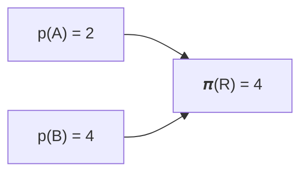

RTIC

<h1 align="center">硬件加速的 Rust RTOS</h1>

用于构建实时系统的并发框架

# 前言

本书包含实时中断驱动并发 (RTIC) 框架的用户级文档. API 参考见 [这里](../../api/).

这是 RTIC v2.x 的文档.

旧版本:
[RTIC v1.x](/1) | [RTIC v0.5.x (不支持)][v0_5] | [RTFM v0.4.x (不支持)][v0_4]

[v0_5]: https://github.com/rtic-rs/rtic/tree/release/v0.5
[v0_4]: https://github.com/rtic-rs/rtic/tree/release/v0.4

{{#include ../../../README.md:7:12}}

## RTIC 是 RTOS 吗?

一个常见的问题是 RTIC 是否是 RTOS, 答案可能因你的背景而异. 从 RTIC 开发者的角度来看, RTIC 是一个硬件加速的 RTOS, 它利用 Cortex-M MCU 上的 NVIC、RISC-V 上的 CLIC 等硬件来执行调度, 而非更传统的软件内核.

社区中的另一种常见观点认为 RTIC 是一个并发框架, 因为它没有软件内核, 并且依赖于外部 HAL.

## RTIC - 过去, 现在与未来

本节介绍 RTIC 模型的背景. 如果想跳过 TL;DR, 可以直接阅读 [RTIC 模型](preface.md#rtic-the-model) 一节.

RTIC 框架的出发点是瑞典吕勒奥理工大学 (LTU) 的实时系统研究. RTIC 灵感来自 [Timber] 语言的并发模型, 基于 [RTFM-SRP] 的调度器, [RTFM-core] 语言以及 [Abstract Timer] 实现. 相关研究的完整列表见 [RTFM][rtfm_publications] 和 [RTIC][rtic_publications] 的论文列表.

[Timber]: https://web.archive.org/web/2023/0325133224/http://timber-lang.org/
[RTFM-SRP]: https://www.diva-portal.org/smash/get/diva2:1005680/FULLTEXT01.pdf
[RTFM-core]: https://ltu.diva-portal.org/smash/get/diva2:1013248/FULLTEXT01.pdf
[Abstract Timer]: https://ltu.diva-portal.org/smash/get/diva2:1013030/FULLTEXT01.pdf
[rtfm_publications]: http://ltu.diva-portal.org/smash/resultList.jsf?query=RTFM&language=en&searchType=SIMPLE&noOfRows=50&sortOrder=author_sort_asc&sortOrder2=title_sort_asc&onlyFullText=false&sf=all&aq=%5B%5B%5D%5D&aqe=%5B%5D&aq2=%5B%5B%5D%5D&af=%5B%5D
[rtic_publications]: http://ltu.diva-portal.org/smash/resultList.jsf?query=RTIC&language=en&searchType=SIMPLE&noOfRows=50&sortOrder=author_sort_asc&sortOrder2=title_sort_asc&onlyFullText=false&sf=all&aq=%5B%5B%5D%5D&aqe=%5B%5D&aq2=%5B%5B%5D%5D&af=%5B%5D

## 基于栈资源策略的调度

基于 [栈资源策略 (SRP)][SRP] 的并发和资源管理是 RTIC 框架的核心. SRP 模型本身是对 [优先级继承协议] 的扩展, 为单核调度提供了一系列出色的特性. 列举如下:

- 可抢占的无死锁且无竞争的调度
- 资源高效
  - 任务在单个共享栈上执行
  - 任务以 run-to-completion 方式执行, 对共享资源的访问无需等待
- 可预测的调度, 通过单个 (具名) 临界区实现有界优先级反转
- 理论支撑利于静态分析 (例如任务响应时间和整体可调度性)

SRP 伴随一系列系统级要求:
- 每个任务关联一个静态优先级,
- 任务在单核上执行,
- 任务必须 run-to-completion,
- 资源必须以 LIFO 顺序声明/锁定.

[SRP]: https://link.springer.com/article/10.1007/BF00365393
[Priority Inheritance Protocols]: https://ieeexplore.ieee.org/document/57058

## SRP 分析

基于 SRP 的调度需要已知一组静态优先级任务及其对共享资源的访问, 才能为每个资源计算一个静态 *上限* (𝝅). 静态资源 *上限* 𝝅(r) 反映了访问资源 `r` 的所有任务中的最大静态优先级.

### 示例

假设两个任务 `A` (优先级 `p(A) = 2`) 和 `B` (优先级 `p(B) = 4`) 都访问共享资源 `R`. `R` 的静态上限为 4 (计算自 `𝝅(R) = max(p(A) = 2, p(B) = 4) = 4`).

上述示例的图示表示:

## RTIC: 硬件加速的实时调度器

SRP 本身既兼容动态优先级调度, 也兼容静态优先级调度. 在 RTIC 的实现中, 我们利用底层硬件实现加速的静态优先级调度.

对于 `ARM Cortex-M` 架构, 每个中断向量条目 `v[i]` 关联一个函数指针 (`v[i].fn`), 一个静态优先级 (`v[i].priority`), 一个使能位 (`v[i].enabled`) 和一个挂起位 (`v[i].pending`).

中断 `i` 在以下条件下被硬件调度 (运行):
1. 处于 `pending` 且 `enabled` 状态, 且优先级高于 (可选的) `BASEPRI` 寄存器, 并且
1. 在满足条件 1 的中断中具有最高优先级.

第一个条件 (1) 可视为一个过滤器, 允许 RTIC 控制哪些任务可以启动 (以及阻止哪些任务启动).

另一方面, 用于单核静态调度的 SRP 模型规定任务应在以下条件下被调度 (运行):
1. 被 `requested` 运行, 且其静态优先级高于当前系统上限 (𝜫)
1. 在满足条件 1 的任务中具有最高的静态优先级.

两者之间的相似性非常显著, 这并非偶然. 硬件在设计之初就考虑到了实时调度.

要将 SRP 调度映射到硬件, 我们需要更仔细地审视系统上限 (𝜫). 在 SRP 中, 𝜫 被计算为当前持有资源的最大优先级上限, 因此在系统运行过程中会动态变化.

### 示例

沿用上述任务模型. 从空闲系统出发, 𝜫 为 0 (没有任务持有任何资源). 假设 `A` 被请求执行, 它将立即被调度. 假设 `A` 声明 (锁定) 资源 `R`. 在 `R` 的声明 (锁定) 期间, 任何对 `B` 的请求都会被阻止启动 (因为 𝜫 = `max(𝝅(R) = 4) = 4`, 而 `p(B) = 4`, SRP 调度条件 1 不满足).

## 映射

将基于静态优先级的 SRP 调度映射到 Cortex-M 硬件非常直接:

- 每个任务 `t` 映射到一个中断向量索引 `i`, 对应函数 `v[i].fn = t`, 并赋予静态优先级 `v[i].priority = p(t)`.
- 当前系统上限映射到 `BASEPRI` 寄存器, 或者通过对中断使能位进行相应的屏蔽来实现.

### 示例

沿用上述运行示例, 在任务 `A` 被挂起等待执行后, ARM Cortex-M [嵌套向量中断控制器 (NVIC)][NVIC] 的快照可能呈现如下配置:

| Index | Fn  | Priority | Enabled | Pending |
| ----- | --- | -------- | ------- | ------- |
| 0     | A   | 2        | true    | true    |
| 1     | B   | 4        | true    | false   |

[NVIC]: https://developer.arm.com/documentation/ddi0337/h/nested-vectored-interrupt-controller/about-the-nvic

(正如后面将讨论的, 中断和异常向量的分配由用户决定.)

一次声明 (lock(r)) 会改变当前系统上限 (𝜫), 可以实现为*具名*临界区:
  - old_ceiling = 𝜫, 𝜫 = 𝝅(r)
  - 在临界区内执行代码
  - 𝜫 = old_ceiling

这相当于一种资源保护机制, 进入临界区只需要两条机器指令, 退出时一条, 用于管理 `BASEPRI` 寄存器. 对于缺少 `BASEPRI` 的架构, 我们可以通过一组机器指令在具名临界区进入/退出时禁用/使能中断来实现系统上限. 所需机器指令的数量取决于需要更新的屏蔽寄存器数量 (单条机器操作最多可作用于 32 个中断, 因此对于 M0/M0+ 架构, 单条指令即可). RTIC 会在编译时确定上限值和屏蔽常量, 因此用 Rust 的术语来说, 所有操作都是零成本的.

通过这种方式, RTIC 将基于 SRP 的可抢占调度与零成本的硬件加速实现融为一体, 从而获得"同类最佳"的保证和性能.

既然这个方法如此简单, 为何 SRP 和硬件加速调度还没有被其他主流 RTOS 采用?

答案很简单: 通常采用的线程模型并不适合静态分析 - 尚无已知的方法可以在编译时从源码中提取任务/资源依赖关系 (因此无法高效地计算上限, 也无法保证资源锁定的 LIFO 要求). 因此, 对于任何基于线程的 RTOS, 基于 SRP 的调度在一般情况下都是无法实现的.

## RTIC 的未来

异步编程以各种形式获得了越来越广泛的关注和语言支持. Rust 原生提供了 `async`/`await` API 用于协作式多任务, 编译器会生成用于存取执行上下文 (即管理跨每个 `await` 的局部变量集合) 的样板代码.

Rust 标准库提供了用于动态分配数据结构的集合, 这些集合在运行时管理执行上下文非常有用. 然而, 在资源受限的实时系统中, 动态分配是有问题的 (无论性能还是可靠性 - Rust 在内存不足时会*panic*). 因此, 静态分配是更可取的方式!

从建模的角度看, `async/await` 放宽了 SRP 的 run-to-completion 要求, 两个 yield 点 (`await`) 之间的每段代码都可以视为一个独立的任务. 编译器会拒绝任何在持有资源时 `await` 的尝试 (不这样做会破坏 SRP 下资源使用的严格 LIFO 要求).

那么, 抛开技术细节, `async/await` 究竟带来了什么?

答案是 - 更好的人机工程学! 一个反复出现的使用场景是, 让任务依次发起一系列请求, 然后等待它们的结果以推进. 没有 `async`/`await`, 程序员不得不将任务拆分为若干子任务, 并维护某种状态编码 (然后通过手动选择子任务来推进). 使用 `async/await`, 每个 yield 点 (`await`) 本质上代表一个状态, 推进机制会在编译时通过 `Futures` 自动为你构建.

Rust 的 `async`/`await` 支持尚不完善, 仍在开发中. 但它已覆盖大多数常见用例, 可以视为生产可用的.

一个重要的特性是, future 是可组合的, 因此你可以等待任意一个、所有或任意组合的 future (从而可以例如, 及时地处理超时和/或异步错误).

## RTIC 模型

一个 RTIC `app` 是面向单核应用的声明式且可执行的系统模型, 它定义了一组 (`local` 和 `shared`) 资源, 由一组 (`init`, `idle`, *硬件* 和 *软件*) 任务操作. 简而言之, `init` 任务在任何其他任务之前运行, 并返回一组资源 (`local` 和 `shared`). 任务根据其关联的静态优先级可抢占地运行, `idle` 具有最低优先级 (可用于后台工作, 和/或在事件唤醒前使系统休眠). 硬件任务绑定到底层硬件中断, 而软件任务由异步执行器 (每个软件任务优先级一个) 进行调度.

在编译时, 任务/资源模型会按照 SRP 进行分析, 并生成具有以下出色属性的可执行代码:

- 保证在单个共享栈上的无竞争资源访问和无死锁执行 (得益于 SRP)
  - 硬件任务调度直接由硬件执行, 并且
  - 软件任务调度由为应用量身定制的自动生成的异步执行器执行.

RTIC API 的设计确保 SRP 要求和 Rust 的健全性规则始终得到遵守, 因此可执行模型在构造上就是正确的. 总体而言, 与手写实现相比, 生成的代码不会带来任何额外开销, 因此用 Rust 的术语说, RTIC 提供了零成本的并发抽象.
